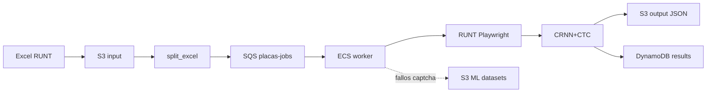
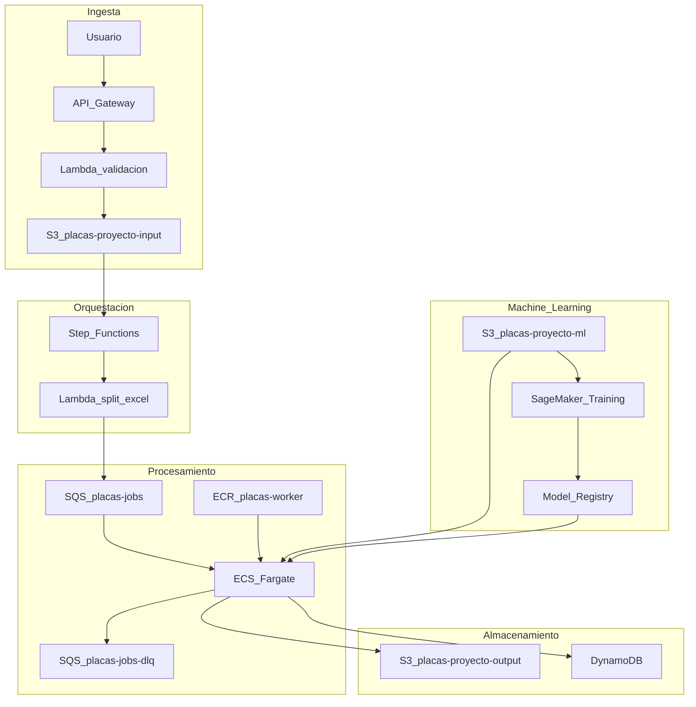

# Arquitectura — Proyecto Integrador II

Consulta masiva de placas en el **RUNT Colombia** mediante web scraping (**Playwright**), resolución de captcha con **CRNN + CTC** (TensorFlow/Keras), e integración en arquitectura **AWS** (o emulación local con **Floci**).

**Portal objetivo:** [Consulta vehículo — RUNT](https://www.runt.gov.co/consultaCiudadana/#/consultaVehiculo)

---

## Resumen

| Capa | Tecnología | Rol |
|------|------------|-----|
| Ingesta | S3 + API/Lambda (diseño) | Excel con placas y documentos |
| Orquestación | Step Functions + `split_excel` | Particionar Excel → SQS |
| Cola | SQS + DLQ | Un mensaje por placa; absorbe lotes 1.000+ |
| Procesamiento | ECS Fargate + ECR | Playwright + inferencia OCR en contenedor |
| Estado | DynamoDB | Jobs y resultados por `job_id` / `placa` |
| ML (producción) | SageMaker + S3 `placas-proyecto-ml` | Reentrenamiento CRNN+CTC (no en Floci) |

---

## Flujo de negocio

1. El usuario sube un **Excel** a S3 con columnas `numero_placas`, `cod_id`, `id`.
2. El sistema **valida** placas y registra el job en DynamoDB (`placas-jobs`).
3. El **orquestador** (`orchestrator/split_excel.py`) lee el Excel y publica **un mensaje SQS por placa**.
4. Cada **worker** consume un mensaje, abre el RUNT con Playwright, resuelve el captcha con el modelo y extrae datos del vehículo.
5. El resultado se guarda en **S3** (`placas-proyecto-output`) y el estado en **DynamoDB** (`placas-results`).
6. Captchas fallidos pueden enviarse a `placas-proyecto-ml` para **reentrenamiento** (SageMaker en AWS real).



---

## Arquitectura de aplicación (código integrado)

El código original en `Modelo/` se integró en el worker y orquestador:

| Origen (`Modelo/`) | Destino en el repo | Función |
|--------------------|--------------------|---------|
| `Extraer_info_sufi 5.py` | `worker/src/scraper.py` | Navegación Playwright, formulario RUNT, extracción |
| `functions.py` (XPaths) | `worker/src/runt_xpaths.py` | Selectores del portal |
| `functions.py` (mensajes) | `worker/src/runt_messages.py` | Textos de error de captcha |
| `Modelo Experimental.ipynb` | Referencia / `Modelo/` | Entrenamiento CRNN+CTC |
| `OCR_captcha_model_V2_EX4 4.keras` | `worker/models/captcha_model.keras` | Pesos para inferencia |
| — | `worker/src/ocr/` | Preproceso OpenCV + decodificación CTC |
| — | `orchestrator/split_excel.py` | Excel → mensajes SQS |
| — | `worker/src/main.py` | Consumo SQS, persistencia S3/DynamoDB |

### Módulos del worker

```
worker/src/
├── main.py              # Loop SQS → scrape_plate → S3 + DynamoDB
├── scraper.py           # Playwright + captcha + campos del vehículo
├── plate_validation.py  # Validación de formato de placa
├── runt_xpaths.py       # XPaths del formulario RUNT
├── runt_messages.py     # Respuestas de captcha incorrecto
├── aws_client.py        # Cliente boto3 con endpoint Floci/AWS
└── ocr/
    ├── preprocess.py    # Pipeline OpenCV (280×80)
    ├── ctc_layer.py     # Capa CTC para cargar .keras
    └── inference.py     # predict_captcha()
```

---

## Modelo OCR (CRNN + CTC)

Arquitectura entrenada en `Modelo/Modelo Experimental.ipynb` e inferida en `worker/src/ocr/`.

| Aspecto | Detalle |
|---------|---------|
| **Tipo** | CNN (Conv2D + MaxPooling) → reshape → BiLSTM ×2 → Dense por timestep → **CTC** |
| **Entrada** | Imagen captcha preprocesada **280×80** (escala de grises, umbral, morfología) |
| **Salida** | 5 caracteres (decodificación CTC greedy) |
| **Alfabeto** | 57 caracteres (`23456789ABCDEFGHJKMNPQRSTUVWXYZabcdefghijklmnopqrstuvwxyz`) |
| **Dataset** | 3.457 imágenes etiquetadas (`Modelo/Imagenes Modelo V2 Limpias`) |
| **Artefacto** | `worker/models/captcha_model.keras` (~7.5 MB) |
| **Variable** | `CAPTCHA_MODEL_PATH` (por defecto `/app/models/captcha_model.keras` en Docker) |

**Por qué inferencia en ECS y no SageMaker Endpoint:** el modelo es pequeño, la latencia de red a un endpoint no aporta en scraping síncrono, y el worker ya carga TensorFlow en el mismo proceso que Playwright.

**Reentrenamiento:** SageMaker Training Job en AWS real; en local se entrena con el notebook y se copia el `.keras` con `python scripts/sync_captcha_model.py`.

---

## Contratos de datos

### Excel de entrada

| Columna | Descripción | Ejemplo |
|---------|-------------|---------|
| `numero_placas` | Placa a consultar | `ABC123` |
| `cod_id` | Tipo documento (1=CC, 2=NIT, …) | `2` |
| `id` | Número de documento | `900123456` |

Ruta S3: `s3://placas-proyecto-input/jobs/{job_id}/placas.xlsx`

### Mensaje SQS (`placas-jobs`)

```json
{
  "job_id": "demo-001",
  "placa": "ABC123",
  "cod_id": 2,
  "documento_id": "900123456"
}
```

### Resultado JSON (S3 output)

Ruta: `s3://placas-proyecto-output/jobs/{job_id}/results/{placa}.json`

```json
{
  "job_id": "demo-001",
  "placa": "ABC123",
  "cod_id": 2,
  "documento_id": "900123456",
  "success": true,
  "data": {
    "Placa": "ABC123",
    "Marca": "...",
    "Modelo": "..."
  },
  "error": null,
  "elapsed_seconds": 12.5,
  "processed_at": "2026-05-18T12:00:00+00:00"
}
```

### DynamoDB

| Tabla | Clave | Uso |
|-------|-------|-----|
| `placas-jobs` | `job_id` (HASH) | Estado del lote (`QUEUED`, total placas) |
| `placas-results` | `job_id` (HASH) + `placa` (RANGE) | `SUCCESS` / `FAILED`, puntero `s3_key` |

### Campos extraídos del vehículo

Definidos en `worker/src/scraper.py` (`VEHICLE_FIELDS`): placa, marca, modelo, chasis, cilindraje, combustible, línea, color, motor, VIN, matrícula, garantías, etc.

---

## Diagrama de arquitectura AWS (producción)



---

## Servicios AWS y justificación

| Servicio | Uso | Por qué |
|----------|-----|---------|
| **S3** | Excel entrada, JSON salida, captchas fallidos, pesos `.keras` | Almacenamiento durable; desacopla ingestión, entrenamiento e inferencia |
| **API Gateway + Lambda** | Subida y consulta por `job_id` | Tareas cortas sin Playwright; pago por invocación |
| **Step Functions** | Validar → particionar → monitorear lote | Visibilidad, reintentos, narrativa para defensa |
| **SQS + DLQ** | Cola `placas-jobs` (redrive tras 3 intentos) | Absorbe 1.000+ placas; controla concurrencia de navegadores |
| **ECS Fargate + ECR** | Worker Python + Chromium + TensorFlow | Sin límite de 15 min; imagen con Playwright y ML |
| **DynamoDB** | `placas-jobs`, `placas-results` | Consultas O(1) por `job_id` |
| **CloudWatch** | Logs y métricas | Tasa de éxito captcha, latencia, alarmas DLQ |
| **Secrets Manager** | Credenciales (si aplica) | Sin secretos en la imagen Docker |
| **SageMaker Training** | Reentrenar CRNN+CTC | GPUs bajo demanda |
| **SageMaker Model Registry** | Versionar modelos | Trazabilidad y rollback |

---

## Por qué ECS y no Lambda para el worker

| Criterio | Lambda | ECS Fargate |
|----------|--------|-------------|
| Playwright + Chromium | Imagen grande, cold start alto | Contenedor dedicado, más estable |
| Duración por placa | Máx. 15 min | Sin límite práctico del task |
| Lotes 1.000+ placas | Muchas invocaciones costosas | Escala con profundidad de cola |
| TensorFlow + OpenCV | Límite de tamaño / memoria | 2 GB+ RAM en task definition |
| Depuración | Limitada | Logs + capturas en S3 |

---

## Inferencia vs entrenamiento

| Fase | Dónde | Motivo |
|------|-------|--------|
| **Inferencia** (captcha en tiempo real) | ECS worker (`worker/src/ocr/inference.py`) | Modelo pequeño; mismo proceso que Playwright |
| **Entrenamiento** (nuevos captchas) | SageMaker Training Job (AWS) o notebook local | GPU bajo demanda |

En **Floci local**, SageMaker no está emulado: entrenas con `Modelo/Modelo Experimental.ipynb`, sincronizas pesos con `scripts/sync_captcha_model.py` y el worker los carga al arrancar.

---

## Recursos creados por bootstrap

Ejecutar: `python infrastructure/bootstrap/bootstrap.py`

| Recurso | Nombre |
|---------|--------|
| S3 | `placas-proyecto-input`, `placas-proyecto-output`, `placas-proyecto-ml` |
| SQS | `placas-jobs` (redrive → `placas-jobs-dlq`, max 3 recepciones) |
| DynamoDB | `placas-jobs`, `placas-results` |
| ECR | `placas-worker` |

### Layout S3

```
placas-proyecto-input/
  jobs/{job_id}/placas.xlsx

placas-proyecto-output/
  jobs/{job_id}/results/{placa}.json

placas-proyecto-ml/
  datasets/captcha/raw/
  datasets/captcha/labeled/
  models/crnn-ctc/v1/
  training-logs/
```

---

## Desarrollo local con Floci

Floci expone servicios en `http://localhost:4566`. El código `boto3` usa `AWS_ENDPOINT_URL` (ver `.env.example`).

```powershell
docker compose up -d
python infrastructure\bootstrap\bootstrap.py
python scripts\verify_floci.py

# Demo: Excel → SQS
python scripts\create_sample_excel.py
python orchestrator\split_excel.py --job-id demo-001 --s3-key jobs/demo-001/placas.xlsx

# Worker local
cd worker
pip install -r requirements.txt
playwright install chromium
$env:AWS_ENDPOINT_URL = "http://localhost:4566"
python -m src.main
```

**Servicios emulados:** S3, SQS, DynamoDB, ECR, ECS (parcial), Step Functions, CloudWatch Logs.

**No emulado:** SageMaker (diseño objetivo en AWS real).

### Variables de entorno relevantes

| Variable | Descripción |
|----------|-------------|
| `AWS_ENDPOINT_URL` | `http://localhost:4566` en local |
| `S3_BUCKET_INPUT` / `S3_BUCKET_OUTPUT` | Buckets de entrada y salida |
| `SQS_QUEUE_NAME` | `placas-jobs` |
| `DYNAMODB_TABLE_JOBS` / `DYNAMODB_TABLE_PLACAS` | Tablas de estado |
| `CAPTCHA_MODEL_PATH` | Ruta al `.keras` |
| `HEADLESS` | `true` / `false` para Playwright |
| `CAPTCHA_MAX_RETRIES` | Reintentos si falla captcha (default 5) |
| `EDGE_EXECUTABLE_PATH` | Opcional: usar Edge instalado en lugar de Chromium |

---

## Contenedor del worker

- **Imagen:** `worker/Dockerfile` — Python 3.12, OpenCV, TensorFlow, Playwright + Chromium.
- **Task definition:** `infrastructure/ecs/task-definition.json`
- **Comando:** `python -m src.main`

```powershell
docker build -t placas-worker worker/
docker run --rm -e AWS_ENDPOINT_URL=http://host.docker.internal:4566 placas-worker
```

---

## Ética y cumplimiento

- Respetar términos de uso y políticas del RUNT.
- Uso académico y **limitación de tasa** (concurrencia SQS / delays en scraper).
- Minimizar datos personales: solo documento y placa necesarios para la consulta.
- No redistribuir datos extraídos fuera del alcance del proyecto.

---

## Referencias en el repositorio

| Componente | Ruta |
|------------|------|
| Floci | `docker-compose.yml` |
| Bootstrap | `infrastructure/bootstrap/bootstrap.py` |
| Orquestador | `orchestrator/split_excel.py` |
| Worker | `worker/src/main.py`, `worker/src/scraper.py` |
| OCR | `worker/src/ocr/` |
| Modelo entrenado | `worker/models/captcha_model.keras` |
| Código original | `Modelo/` |
| Step Functions | `infrastructure/stepfunctions/placas-pipeline.asl.json` |
| ECS task | `infrastructure/ecs/task-definition.json` |
| Demo | `scripts/run-demo.ps1`, `scripts/create_sample_excel.py` |
| Presentación | `docs/presentacion.html` |
